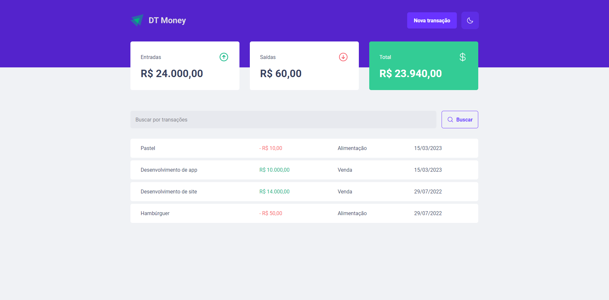
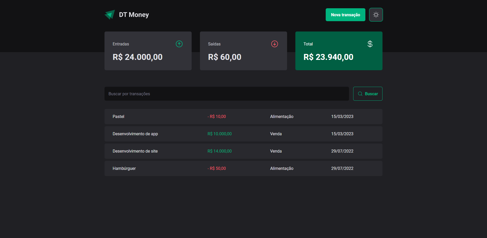

<h1 align="center">
    
</h1>

    
    

## :rocket: Tecnologias

Foram usadas as seguintes tecnologias:

- [ReactJS](https://reactjs.org)
- [Typescript](https://www.typescriptlang.org)
- [Styled-Components](https://styled-components.com)
- [MirageJS](https://miragejs.com)
- [JSON Server](https://github.com/typicode/json-server)

## :computer: Projeto

O dt money é uma aplicação desenvolvida durante o ignite da [Rocketseat](https://www.rocketseat.com.br) para controle de finanças, com cadastro de entradas e saídas. Apesar de ser uma aplicação simples, além de dar uma força a mais em conteúdos que já tinha visto, pude aprender coisas novas, como o uso do MirageJS.

O [MirageJS](https://miragejs.com) é uma biblioteca para mocar os dados, dessa forma o desenvolvimento do frontend pode continuar avançando sem depender diretamente do backend.

Com uma atualização desse projeto para aprender um pouco mais sobre performance, removi o MirageJS e adicionei os dados com [json-server](https://github.com/typicode/json-server). Adicionei responsividade e também um dark mode.

## :thinking: Como rodar o projeto?

1. Primeiramente faça o clone do projeto com `git clone https://github.com/erik-ferreira/dtmoney.git`

2. Execute `npm i` para instalar as dependências

3. Execute `npm run dev:server` para rodar json-server

4. Depois basta executar `npm run dev` para rodar o projeto
